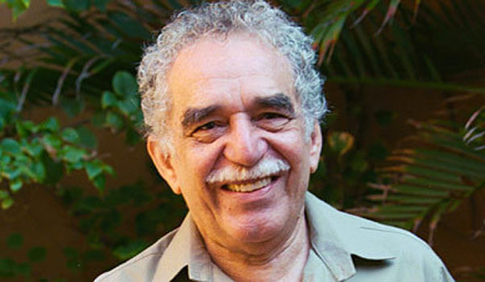

## Gabriel García Márquez

* * *

Bio -

Gabriel García Márquez was a nobel prize winner colombian novelist and short-story writer. He is considered as the one of the most significant twentieth century writer. He wrote in spanish. His style of writing is known as Magical Realism. Marquez started his career as a journalist and wrote non-fiction works and short-stories.

### Summary

  Name: Gabriel García Márquez
  Born: 6 March 1927
  Death: 17 April 2014
  Father: Gabriel Eligio García
  Mother: Luisa Santiaga Márquez Iguarán
  Spouse: Mercedes Barcha
  

Works

*   In Evil Hour (1962)
*   One Hundred Years of Solitude (1967)
*   The Autumn of the Patriarch (1975)
*   Love in the Time of Cholera (1985)
*   The General in His Labyrinth (1989)
*   Of Love and Other Demons (1994)

Read More

1.  [https://en.wikipedia.org/wiki/Gabriel_Garc%C3%ADa_M%C3%A1rquez](https://en.wikipedia.org/wiki/Gabriel_Garc%C3%ADa_M%C3%A1rquez)
